# EduQuest - Backend

**Proyecto:** EduQuest — Plataforma educativa de materiales, grupos de estudio y planes inteligentes
**Curso:** CS 2031 Desarrollo Basado en Plataforma
**Entrega:** Semana 7 — Backend completo
**Integrantes:**

| Nombre | Código |
|---|---|
| Juan Pablo Saavedra Ruiz | 202510537 |
| Piero Alejandro Ortega Capacute | 202510580 |
| Omar Alonzo Guzmán Harvey | 202510519 |
| Edson Yenen Falcon Jimenez | 202510492 |

**Deployment:** desplegado — evidencias en la sección [Evidencias del Deploy](#evidencias-del-deploy).

---

## Índice

1. [Introducción](#introducción)
2. [Identificación del Problema o Necesidad](#identificación-del-problema-o-necesidad)
3. [Descripción de la Solución](#descripción-de-la-solución)
4. [Modelo de Entidades](#modelo-de-entidades)
5. [Decisiones de Diseño](#decisiones-de-diseño)
6. [Manejo de Errores](#manejo-de-errores)
7. [Medidas de Seguridad Implementadas](#medidas-de-seguridad-implementadas)
8. [Eventos y Asincronía](#eventos-y-asincronía)
9. [Instalación y Ejecución Local](#instalación-y-ejecución-local)
10. [Pruebas y Cobertura](#pruebas-y-cobertura)
11. [Variables de Entorno](#variables-de-entorno)
12. [Endpoints Documentados](#endpoints-documentados)
13. [Evidencias del Deploy](#evidencias-del-deploy)
14. [GitHub & Management](#github--management)
15. [Conclusión](#conclusión)
16. [Apéndices](#apéndices)

---

## Introducción

### Contexto

Los estudiantes universitarios y escolares carecen de una plataforma unificada que combine el acceso libre a materiales de estudio con entornos privados para asesorías académicas. Además, no cuentan con herramientas que les ayuden a planificar una metodología de estudio eficiente según la dificultad real de sus cursos. EduQuest nace para cerrar esa brecha: una única plataforma donde el estudiante encuentra recursos, comunidad y planificación inteligente.

### Objetivos del Proyecto

- Brindar un repositorio abierto de materiales de estudio (documentos) organizados y calificables por la comunidad.
- Permitir la creación de grupos privados de estudio donde se organicen sesiones de asesoría.
- Generar planes de estudio personalizados a partir de la percepción de dificultad de cada curso, apoyándose en una API de inteligencia artificial.
- Implementar un backend robusto: autenticación JWT, roles, manejo global de errores, eventos asíncronos y notificaciones por correo.

## Identificación del Problema o Necesidad

### Descripción del Problema

Los materiales de estudio están dispersos entre plataformas, páginas personales y servidores no oficiales; las asesorías se gestionan por canales informales (mensajería, correos); y la planificación del estudio se hace de forma empírica sin considerar la dificultad real de cada curso. Esta dispersión aumenta el tiempo que el estudiante pierde buscando recursos válidos y reduce la efectividad de su preparación.

### Justificación

Una plataforma que centralice materiales confiables, grupos privados de asesoría y un generador de planes de estudio resuelve tres dolores concretos: acceso a contenido validado por la comunidad (reseñas), acompañamiento académico organizado y una metodología de estudio adaptativa. Esto beneficia directamente el rendimiento académico y reduce la fricción de prepararse en solitario.

## Descripción de la Solución

### Funcionalidades Implementadas

- **Registro y autenticación de usuarios:** registro, login y renovación de tokens (access/refresh) con contraseñas cifradas con BCrypt.
- **Consulta del perfil propio:** endpoint protegido `/users/me` que expone los datos y roles del usuario autenticado.
- **Biblioteca de documentos:** subir y listar materiales académicos en la biblioteca abierta.
- **Grupos privados:** crear grupos de estudio y listar los existentes.
- **Sesiones de asesoría:** reservar y listar sesiones de estudio dentro de un grupo privado, con enlace de reunión.
- **Plan de estudio inteligente:** el usuario ingresa un curso y su dificultad percibida; el backend consulta a OpenAI y devuelve una metodología de estudio generada.
- **Reseñas:** calificar y comentar documentos (1–5 estrellas) con validación de una reseña por usuario y por documento.
- **Administración de usuarios:** el rol ADMIN/MANAGER puede listar usuarios y el ADMIN puede cambiar roles.

### Tecnologías Utilizadas

- **Java 21 + Spring Boot 4.1.1** (Spring Web, Data JPA, Security, Validation, Mail).
- **PostgreSQL 18** (motor de base de datos, mediante Docker Compose en local).
- **JWT (jjwt 0.12.6)** para autenticación sin estado.
- **Lombok** para reducir código repetitivo en entidades y DTOs.
- **Thymeleaf** para plantillas HTML de correos.
- **API externa de OpenAI (gpt-4o-mini)** para la generación de planes de estudio.
- **Docker / Docker Compose** para la base de datos local.

## Modelo de Entidades

### Diagrama

```
User ──< Document >──< Tag
User >──< Role
User ──< Review >── Document
User ──< StudyPlan
PrivateGroup ──< Document
PrivateGroup ──< StudySession
```

### Descripción de Entidades

- **User:** estudiantes y asesores. Campos únicos para `username` y `email`; relación muchos-a-muchos con `Role`.
- **Role:** roles del sistema (enum `RoleName`: `ROLE_USER`, `ROLE_ADMIN`, `ROLE_MANAGER`) sembrados al arrancar.
- **Document:** material bibliográfico con autor (ManyToOne con `User`), etiquetas (ManyToMany con `Tag`) y, opcionalmente, el grupo privado donde se publicó (ManyToOne con `PrivateGroup`, `null` = documento global).
- **Tag:** etiquetas temáticas (por ejemplo "Matemática", "Física").
- **Review:** reseña de un documento (rating 1–5) con restricción única `(user_id, document_id)`.
- **StudyPlan:** plan de estudio generado por IA, asociado a un usuario (ManyToOne con `User`).
- **PrivateGroup:** grupo privado de estudio tipo servidor, con miembros (ManyToMany con `User`).
- **StudySession:** sesión de asesoría programada dentro de un grupo, con enlace de reunión.

Las relaciones usan `FetchType.LAZY` para las asociaciones de colección y `FetchType.EAGER` únicamente para los roles del usuario (cargados en cada autenticación). La colección dueña `Document.tags` usa `cascade = {PERSIST, MERGE}`: el cascade permite persistir y actualizar en cascada las etiquetas al crear o editar el agregado, mientras que los borrados y las asociaciones que referencian entidades ya existentes (roles y miembros de grupos) se gestionan explícitamente en el servicio.

## Decisiones de Diseño

### Arquitectura

```
Cliente (Postman / Frontend)
        │  HTTP/JSON · Authorization: Bearer <JWT>
        ▼
┌──────────────────────────── Spring Boot ────────────────────────────┐
│ Controller (solo HTTP + @Valid DTOs)                                │
│   → Service (interfaces, lógica de negocio)                         │
│       → Repository (JPA/Hibernate)                                  │
│   Eventos: @TransactionalEventListener(AFTER_COMMIT) + @Async       │
│     → EmailService (Thymeleaf HTML) / logs (SLF4J)                 │
│   Seguridad: JwtAuthorizationFilter → SecurityContext → @PreAuthorize│
└─────────────────────────────────────────────────────────────────────┘
        │                        │                          │
        ▼                        ▼                          ▼
   PostgreSQL 18 (JPA)    OpenAI gpt-4o-mini (RestTemplate)    SMTP Gmail
```

- **Controller → Service → Repository:** los controladores solo orquestan HTTP y validan con `@Valid`; la lógica de negocio y las decisiones de autorización viven en los servicios detrás de interfaces, por lo que los controladores se mantienen delgados.
- **DTOs request/response separados:** nunca se exponen entidades al cliente; la contraseña no aparece en ninguna respuesta.
- **Inyección por constructor** en todos los beans y cumplimiento del principio de responsabilidad única.
- **ProblemDetail (RFC 9457)** como formato único de error con `timestamp`, `status`, `error`, `message`, `detail` y `path`, emitido por un `GlobalExceptionHandler` central.
- **HATEOAS considerado:** la API usa URIs REST por recurso (`/users`, `/documents`, `/reviews`) y está versionada en `/api/v1`; los enlaces hipermedia se dejan como evolución futura.
- **Configuración por perfiles:** `test` (H2 en memoria, integración continua) y `prod` (despliegue); el perfil por defecto usa PostgreSQL local mediante `.env`. Los secretos se inyectan con variables de entorno.

- **Paginación:** los endpoints de listado (`/documents`, `/groups`, `/admin/users`, `/documents/{id}/reviews`) aceptan `page` y `size` y responden una envoltura `{ content, page, size, totalElements, totalPages }`.

## Manejo de Errores

Todas las excepciones se centralizan en `GlobalExceptionHandler` (`@RestControllerAdvice`) y se devuelven como **ProblemDetail (RFC 9457)**, el estándar definido en el curso: `type`, `title`, `status`, `detail`, `instance`, `timestamp`, `path`, `error` y `message` (los últimos cuatro cubren a su vez el `ErrorResponseDTO` pedido por el enunciado). Ejemplos:

- 400 – validación (`MethodArgumentNotValidException`) con el mapa `errors` por campo y cuerpo mal formado.
- 401 – credenciales inválidas o token no provisto (via `AuthenticationEntryPoint`).
- 403 – acceso denegado por rol o por falta de permisos sobre el recurso.
- 404 – recurso no encontrado.
- 409 – conflicto (usuario o documento duplicado, reseña ya existente).
- 500 – error externo (por ejemplo, fallo al llamar a OpenAI).

Las excepciones personalizadas (`ResourceNotFoundException`, `DuplicateResourceException`, `InvalidCredentialsException`, `UnauthorizedException`, `ForbiddenException`, `InvalidOperationException`, `BadRequestException`, `ExternalServiceException`) permiten expresar la causa de negocio de cada error y mantener los controladores limpios.

## Medidas de Seguridad Implementadas

### Seguridad de Datos

- **JWT stateless:** `JwtService` genera tokens firmados con `Keys.hmacShaKeyFor(secret)` (secret en variable de entorno, mínimo 64 caracteres → HS512). El token incluye claims de `userId`, `email` y `roles`.
- **Access y refresh tokens:** los tokens de refresh se usan solo en `/auth/refresh`; el filtro rechaza usarlos en endpoints protegidos.
- **Contraseñas** cifradas con `BCryptPasswordEncoder`.
- **Autorización por roles:** `@PreAuthorize` en métodos sensibles. Creamos un admin inicial (`admin@utec.edu.pe`/`admin123`) mediante un inicializador idempotente.
- El filtro `JwtAuthorizationFilter` valida el header `Authorization: Bearer <token>` y carga el `UserPrincipal` en el `SecurityContext`.

### Prevención de Vulnerabilidades

- **Variables de entorno** para secretos (`JWT_SECRET`, credenciales de BD y de Gmail, `OPENAI_API_KEY`); `.env` y `.dockerignore` evitan subir credenciales al repositorio.
- **CSRF deshabilitado** solo por ser una API sin estado (no usa cookies de sesión).
- **Validación de entrada** en todos los DTOs (`@Valid`, `@Email`, `@NotBlank`, `@Size`, `@Pattern`).
- **Consultas por repositorio (JPA)** que previenen inyección SQL.
- **BCrypt con salt** evita el uso de tablas rainbow sobre contraseñas comprometidas.

## Eventos y Asincronía

El sistema publica tres eventos personalizados (`ApplicationEvent`) procesados de forma asíncrona con `@TransactionalEventListener(AFTER_COMMIT)` + `@Async`:

1. **`OnUserRegistrationEvent`:** tras el commit del registro, se envía un correo HTML de bienvenida usando plantillas Thymeleaf.
2. **`OnDocumentUploadedEvent`:** al subir un documento se notifica al autor por correo (tarea que no debe bloquear la respuesta HTTP).
3. **`OnStudyPlanGeneratedEvent`:** se registra el procesamiento del plan generado (logging automatizado).

La asincronía está configurada con `@EnableAsync` y un `ThreadPoolTaskExecutor` con `threadNamePrefix = "EmailThread-"`. Se usan transacciones (`@Transactional`) y el commit como punto de disparo para no enviar correos de operaciones que luego fallan. La comunicación por eventos desacopla publicación (`ApplicationEventPublisher`) y consumidor (`@EventListener`).

## Instalación y Ejecución Local

1. Levantar la base de datos: `docker compose up -d` (PostgreSQL en el puerto 5433).
2. Crear el archivo `.env` en la raíz (ver sección siguiente).
3. Ejecutar: `./mvnw spring-boot:run` (o desde IntelliJ con `EduquestBackendApplication`).
4. La API queda disponible en `http://localhost:8080/api/v1`.

## Pruebas y Cobertura

La suite de pruebas unitarias e integración alcanza un **~98% de cobertura (instrucciones)**, muy por encima del umbral mínimo de **80%** que exige la fase `verify`:

- **Unitarias** (Mockito + AssertJ): servicios (`Auth`, `Document`, `Group`, `Review`, `StudySession`, `StudyPlan`, `Admin`, `OpenAI`, `Email`), seguridad (`JwtService`, `JwtAuthorizationFilter`, `UserDetailsServiceImpl`, `UserPrincipal`), eventos asíncronos, `RoleInitializer` y `GlobalExceptionHandler`.
- **Controladores** (8): verificación de respuestas HTTP y delegación al servicio (incluyendo autenticación vía `Authentication`/`UserPrincipal`).
- **Integración** (`AuthFlowIntegrationTest`, perfil `test` con H2): registro y login, perfil del usuario autenticado, protección de endpoints sin token, paginación real, subida de documentos a un grupo (403 si no eres miembro, 201 si sí) y gestión de roles (ADMIN cambia rol, MANAGER lista pero no cambia, USER no lista).
- **Medición**: JaCoCo genera el reporte en `target/site/jacoco/index.html` y falla el build si la cobertura baja del 80%.

Ejecutar con: `./mvnw verify`

## Variables de Entorno

`DB_HOST`, `DB_PORT`, `DB_NAME`, `DB_USER`, `DB_PASSWORD`, `JWT_SECRET`, `JWT_EXPIRATION_ACCESS`, `JWT_EXPIRATION_REFRESH`, `MAIL_USER`, `MAIL_APP_PASSWORD`, `OPENAI_API_KEY`. Todas se cargan en `application.properties` mediante `spring.config.import=optional:file:./.env[.properties]` y, en producción, son provistas por la plataforma de despliegue.


## Endpoints Documentados

- `POST /api/v1/auth/register` — registro (público).
- `POST /api/v1/auth/login` — login (público).
- `POST /api/v1/auth/refresh` — renovar access token.
- `GET /api/v1/users/me` — perfil del usuario autenticado.
- `GET /api/v1/admin/users?page=0&size=10` y `GET /api/v1/admin/users/{id}` — ADMIN/MANAGER (listado paginado).
- `PATCH /api/v1/admin/users/{id}/role?role=ROLE_MANAGER` — solo ADMIN.
- `GET /api/v1/documents?page=0&size=10` (paginado), `POST /api/v1/documents` — listar / crear documentos.
- `POST /api/v1/groups`, `GET /api/v1/groups?page=0&size=10` — grupos (listado paginado).
- `POST /api/v1/groups/{groupId}/documents` — subir un documento al grupo. **Solo si el usuario es miembro** de ese grupo (403 en caso contrario).
- `POST|GET /api/v1/groups/{groupId}/sessions` — sesiones de asesoría.
- `POST /api/v1/study-plans/generate` — plan de estudio con IA.
- `POST /api/v1/reviews`, `GET /api/v1/reviews/{id}`, `DELETE /api/v1/reviews/{id}` y `GET /api/v1/documents/{documentId}/reviews?page=0&size=10` — reseñas (listado paginado).

La colección completa con ejemplos está en el archivo `postman_collection.json` en la raíz del repositorio.

### Documentación interactiva (Swagger UI)

La API incluye **Swagger UI / OpenAPI 3.1** (springdoc-openapi v3), disponible en:

- `http://localhost:8080/swagger-ui.html` (o `/swagger-ui/index.html`) — interfaz interactiva para probar cada endpoint.
- `http://localhost:8080/v3/api-docs` — spec OpenAPI en JSON.

Para probar los endpoints protegidos, primero genera un token en `POST /api/v1/auth/login` y usa el botón **Authorize** de Swagger pegando el `accessToken` (se envía como `Authorization: Bearer <token>`). El esquema de seguridad se define en `config/OpenAPIConfig.java` y los controladores están documentados con `@Tag`/`@Operation`.

## Evidencias del Deploy

> En esta sección se registran las evidencias del despliegue del backend en la nube. 

### Imágenes del RDC

Evidencias del despliegue tomadas del dashboard/registro del servicio de despliegue:
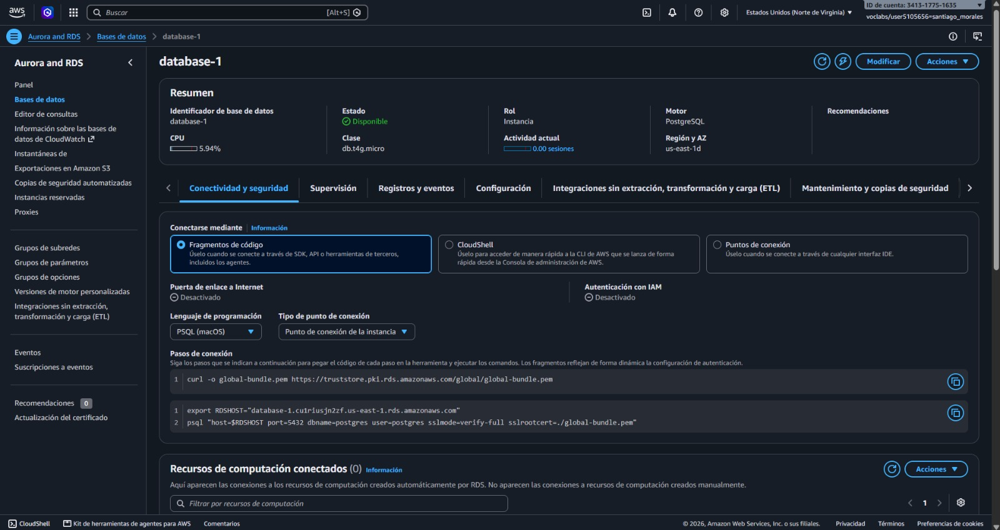

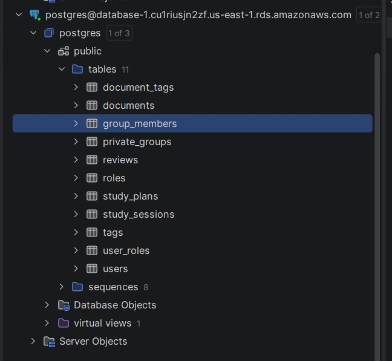

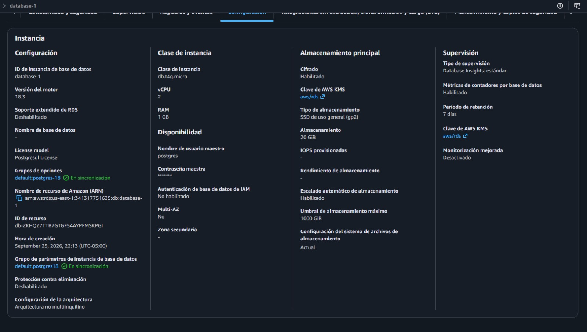

### Evidencias del Deploy en EC2 (AWS)

Muestra la instancia creada, la conexión SSH y la aplicación ejecutándose en un puerto de la instancia:

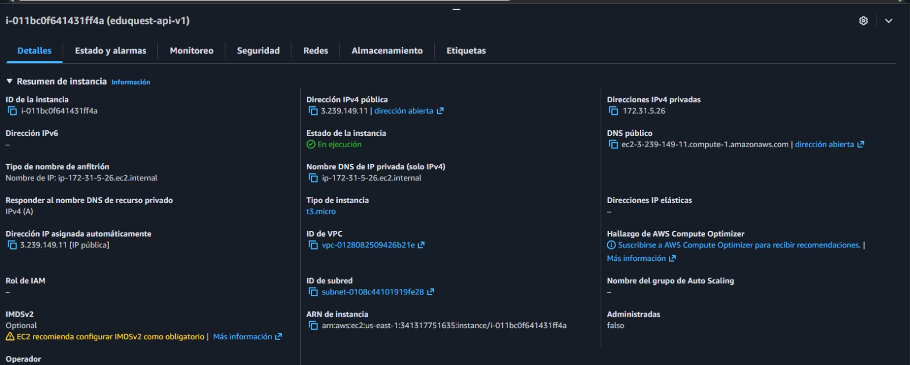

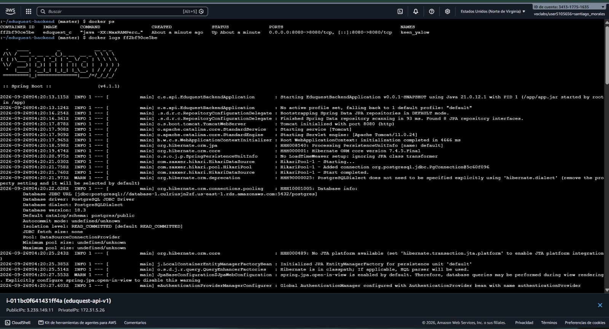


### Evidencias del Postman con el backend desplegado

Ejecución de la colección (`postman_collection.json`) contra la URL pública del backend desplegado:

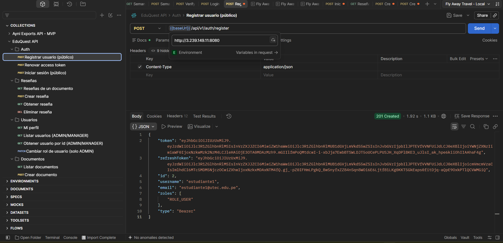


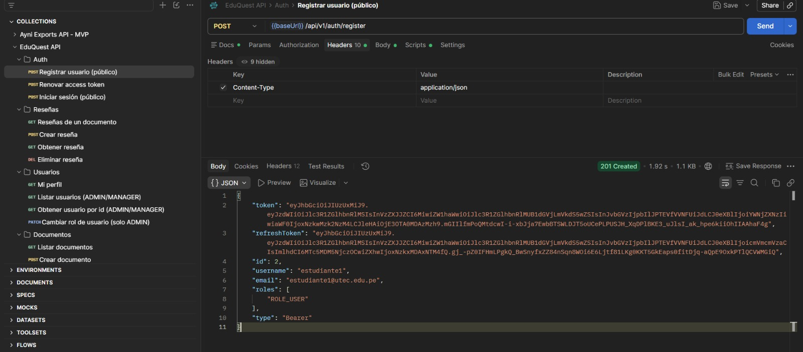

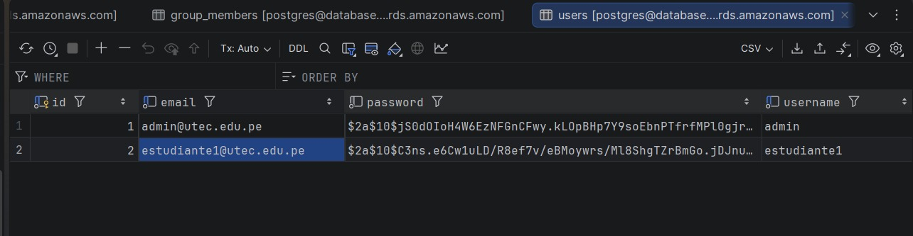


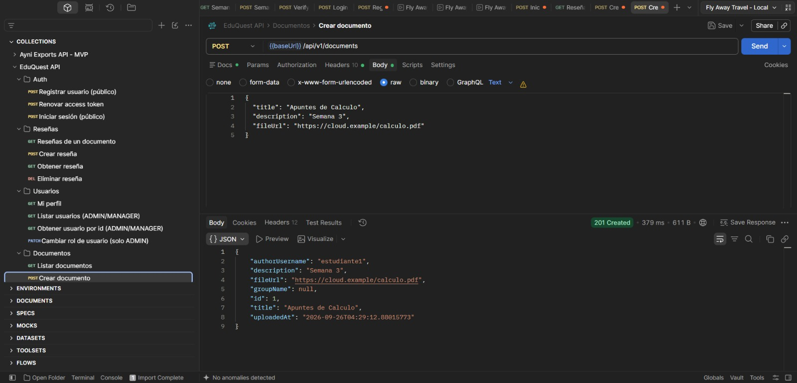

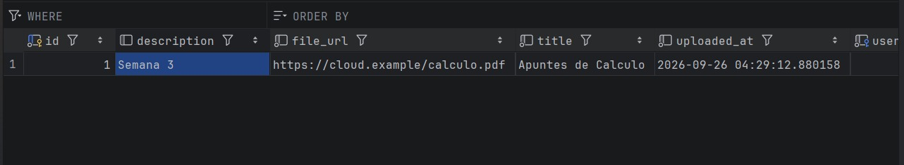


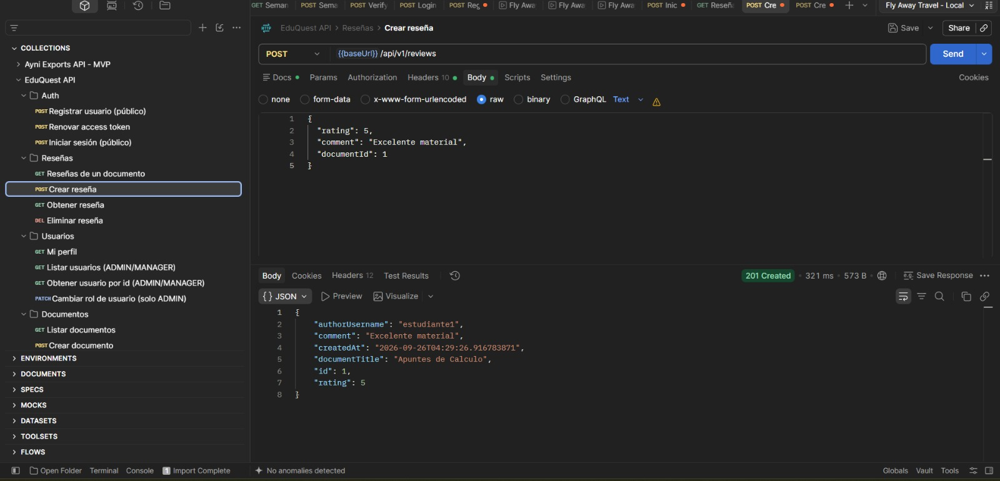

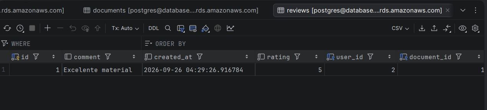

## GitHub & Management

El código vive en un repositorio central en GitHub con `main` como rama de integración y **GitHub Actions** como CI: el flujo compila, ejecuta los tests y valida la cobertura mínima del 80% con JaCoCo (`./mvnw verify`) en cada push. Los avances se registran en commits organizados por misión (seguridad, eventos, deployment) y, para la siguiente fase, la gestión del backlog se hará con GitHub Issues.

## Conclusión

### Logros del Proyecto

EduQuest entrega un backend completo en capas: modelo de 8 entidades con relaciones correctas, 16 DTOs segregados, autenticación JWT con refresh tokens y roles, manejo global de errores en formato ProblemDetail, tres eventos asíncronos con correos HTML, generador de planes de estudio basado en OpenAI y documentación interactiva con Swagger, todo desplegable en la nube con un repositorio limpio y documentado.

### Aprendizajes Clave

El equipo consolidó patrones aprendidos en el curso: arquitectura Controller→Service→Repository, segregación de DTOs, seguridad Spring Security + JWT, eventos/transacciones con `@TransactionalEventListener`, y el manejo estandarizado de errores. El trabajo colaborativo en Git y la automatización con CI fueron fundamentales para mantener la calidad del código.

### Trabajo Futuro

- Búsqueda y filtros avanzados de documentos por etiqueta y universidad.
- Chat en tiempo real dentro de los grupos (Socket.io/Firebase).
- Upload de archivos directo a S3/Cloudinary, incluyendo videos.
- Integración con Google Meet/Zoom para generar enlaces de asesoría automáticamente.

